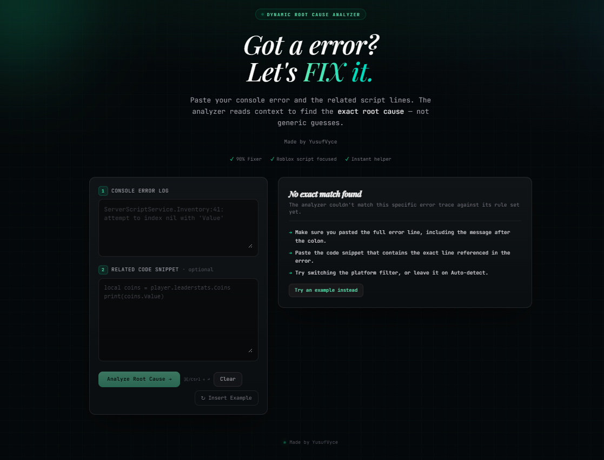

<div align="center">

# Vyce LuaUtility

### Advanced Error Analysis Toolkit for Roblox Luau

Analyze Roblox runtime errors, identify their root causes, and receive actionable debugging insights.

**Built exclusively for Roblox Studio (Luau).**



[Live Demo](https://vyce-lua-utility.vercel.app) •
[Documentation](#documentation) •
[Features](#features)

</div>

---

## 📖 About

Vyce LuaUtility is a developer toolkit designed specifically for **Roblox Studio**.

Instead of matching errors with simple regex patterns, it analyzes the error, surrounding context, and code structure to determine the most likely root cause and provide practical debugging guidance.

> ⚠️ This project is built exclusively for Roblox (Luau). It is **not** intended for FiveM, Love2D, Defold, or other Lua platforms.

---

## ✨ Features

- 🔍 Context-aware error analysis
- 🧠 Root cause detection
- ⚡ Fast analysis engine
- 📚 Detailed explanations
- 💡 Fix suggestions
- 🛡️ Roblox-specific diagnostics
- 🧩 Supports common Luau runtime errors

---

## 🛠 Tech Stack

- TypeScript
- React
- TanStack Router
- Vite
- Bun

---

## 💻 Installation

```bash
git clone https://github.com/YusufVyce/Vyce-LuaUtility.git

cd Vyce-LuaUtility

bun install

bun run dev
